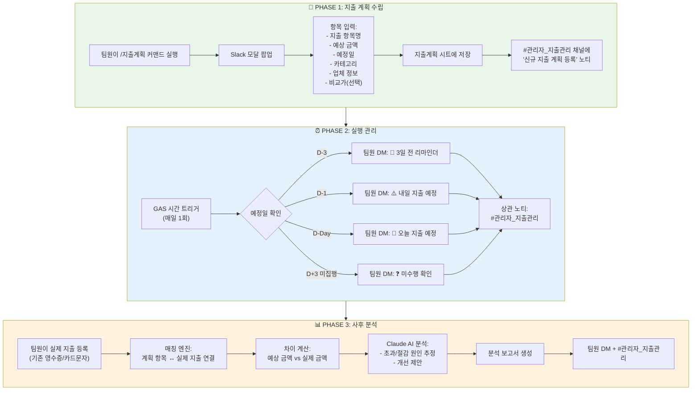

# 📋 재무 지출 계획 관리 자동화 시스템 — 기획서 (PRD)

---
- **문서 ID**: BNK-PRD-2026-03-02-001
- **작성일**: 2026-03-02
- **최종 수정**: 2026-03-02 (자비스 PO — 김감사 QA 피드백 반영 v2)
- **작성자**: 송PO (벙커 팀) → 자비스 PO (피드백 반영)
- **상태**: QA 피드백 반영 완료 → 개발 착수 대기
- **관련 task.md**: `GD_Agent_teams/bunker/tasks/2026-03/task_재무지출계획관리시스템.md`
- **QA 피드백**: `kim-qa/reviews/2026-03/integrated/2026-03-02_재무지출계획_통합리뷰_피드백.md`
---

## 1. 개요

### 1.1 배경

현재 혜림AX의 캐시플로우 봇은 **사후 지출 기록(영수증·카드 문자 → 파싱 → 시트 저장)** 기능에 집중되어 있다.
하지만 팀원이 **지출을 사전에 계획하고, 에이전트가 일정을 관리하며, 사후에 계획 대비 실적을 분석**하는 기능은 없다.

### 1.2 목적

기존 캐시플로우 봇을 확장하여 **"계획 → 실행 → 분석"** 3단계 사이클을 추가한다.

### 1.3 기대 효과

| 효과 | 설명 |
|------|------|
| **예산 가시성** | 팀장·대표가 향후 지출 계획을 사전에 파악 |
| **지출 통제** | 계획 대비 초과/절감을 자동 감지 |
| **업무 효율** | 구매 일정 리마인더로 누락 방지 |
| **데이터 기반 의사결정** | 계획 vs 실제 분석으로 다음 예산 편성 근거 확보 |

---

## 2. 현재 시스템 분석

### 2.1 기존 아키텍처

```
┌──────────────┐          ┌──────────────────┐          ┌──────────────────┐
│   Slack Bot   │ ──API──▶│ Google Apps Script│──SHEET──▶│  Google Sheets   │
│ (캐시플로우)    │◀──DM────│    Code.gs       │──DOC────▶│  Google Docs     │
└──────────────┘          │  (v17.0.0)       │──DRIVE──▶│  Google Drive    │
                          │                  │──AI─────▶│  Claude API      │
                          └──────────────────┘          └──────────────────┘
```

### 2.2 기존 시트 구조

| 시트명 | 용도 | 컬럼 |
|--------|------|------|
| `카드사용내역` | 영수증/카드문자 파싱 기록 | 날짜, 시간, 금액, 가맹점, 카드종류, 항목, 사용직원, 승인번호, 카드사, 입력자, 등록일시, 영수증 |
| `매출내역` | 매출(입금) 기록 | 날짜, 금액, 거래처, 비고, 예정일, 등록일시 |
| `지출내역` | 지출(출금) 기록 | 날짜, 금액, 거래처, 비고, 예정일, 등록일시 |

### 2.3 기존 기능 목록

| 기능 | 상태 | 비고 |
|------|------|------|
| 카드 문자 파싱 (Claude AI) | ✅ 운영 중 | DM으로 전송 |
| 영수증 이미지 OCR (Claude AI) | ✅ 운영 중 | DM으로 전송 |
| 카드 내역 시트 저장 | ✅ 운영 중 | 카드사용내역 시트 |
| 지출결의서 자동 생성 | ✅ 운영 중 | Google Docs 템플릿 |
| `/지출` 슬래시 커맨드 | ✅ 운영 중 | 매출/지출 수동 등록 |
| 월간 리포트 | ✅ 운영 중 | 카테고리별 집계 |
| DM 프라이버시 | ✅ 운영 중 | 타 팀원 열람 불가 |
| 관리자 채널 알림 | ✅ 운영 중 | #관리자_지출관리 |
| 중복 등록 감지 | ✅ 운영 중 | 동일 금액 경고 |
| **지출 사전 계획 등록** | ❌ 없음 | 👈 **신규** |
| **일정 기반 자동 알림** | ❌ 없음 | 👈 **신규** |
| **계획 vs 실제 비교 분석** | ❌ 없음 | 👈 **신규** |

---

## 3. 신규 시스템 설계

### 3.1 확장 아키텍처

```
                         ┌──────────────────────────────────────────┐
                         │         확장 영역 (신규)                  │
                         │                                          │
                         │   📅 PHASE 1        ⏰ PHASE 2          │
                         │   지출계획 등록       일정 알림/노티        │
                         │   (/지출계획 커맨드)  (GAS 트리거)          │
                         │                                          │
                         │         📊 PHASE 3                       │
                         │         계획vs실제 분석                    │
                         │        (Claude AI 요약)                   │
                         └──────────────────────────────────────────┘
                                          │
                                          ▼
┌──────────────┐          ┌──────────────────┐          ┌──────────────────┐
│   Slack Bot   │ ──API──▶│ Google Apps Script│──SHEET──▶│  Google Sheets   │
│ (캐시플로우)    │◀──DM────│ Code.gs (확장)    │         │                  │
└──────────────┘          │                  │          │ ┌──────────────┐ │
      │                   └──────────────────┘          │ │카드사용내역    │ │
      │                                                 │ │매출내역       │ │
      ▼                                                 │ │지출내역       │ │
 #관리자_지출관리                                        │ │지출계획 (NEW) │ │
  채널 노티                                             │ │계획분석 (NEW) │ │
                                                        │ └──────────────┘ │
                                                        └──────────────────┘
```

### 3.2 데이터 흐름도



---

## 4. 기능 상세 명세

### 4.1 PHASE 1 — 지출 계획 수립

#### 4.1.0 UI 방식: 하이브리드 (웹 페이지 + Slack)

> **QA 피드백 반영**: 아키텍처 검토 결과, 별도 HTML 파일(`expense_planner.html`) + Slack 알림 하이브리드 방식 채택

| 채널 | 역할 | 기능 범위 |
|------|------|----------|
| **웹 페이지** (`expense_planner.html`) | 상세 등록·관리·시각화 | 계획 등록/수정/삭제, 네이버 최저가 검색, 계획 목록, 분석 대시보드 |
| **Slack** `/지출계획` | 간편 등록 + 알림 | 필수 필드만 빠르게 등록, D-3/D-1/D-Day 알림, 매칭 제안, 관리자 노티 |

**인증 방식** (🔒 CRITICAL 반영):
- GAS 웹앱 배포: "사용자로 실행 + 액세스: 조직 내 모든 사용자"
- `Session.getActiveUser().getEmail()`로 사용자 식별
- 데이터 필터링: `등록자_slack_id` 기반으로 본인 계획만 표시 (타 팀원 열람 불가)

#### 4.1.1 신규 슬래시 커맨드: `/지출계획` (간편 등록)

**동작**: `/지출계획` 입력 시 Slack 모달이 활성화되어 최소 필드로 빠르게 등록 (상세 등록은 웹 페이지 이용)

**모달 입력 필드**:

| 필드 | 필수 | 유형 | 설명 | 예시 |
|------|------|------|------|------|
| 지출 항목 | ✅ | 텍스트 | 구매할 물품/서비스명 | "사무실 A4 용지 10박스" |
| 예상 금액 | ✅ | 숫자 | 예상 지출 금액 (원) | 150000 |
| 지출 예정일 | ✅ | 날짜 | 실제 구매 예정 날짜 | 2026-03-15 |
| 카테고리 | ✅ | 선택 | 지출 분류 | 소모품비, 식대, 교통비... |
| 업체명 | ⬜ | 텍스트 | 구매 예정 업체 | "쿠팡 비즈니스" |
| 비교가 | ⬜ | 텍스트 (복수) | 타 업체 가격 비교 | "A업체: 14만원, B업체: 16만원" |
| 비교 자료 | ⬜ | 파일 | 견적서 PDF / 가격표 | PDF 업로드 |
| 메모 | ⬜ | 텍스트 | 추가 사유/근거 | "기존 재고 소진, 긴급 구매" |

#### 4.1.2 에이전트 가격 비교 의견 (MVP)

계획 등록 시 에이전트가 입력된 정보를 분석하여 의견을 제공한다:

```
💡 에이전트 의견
━━━━━━━━━━━━━━━━━━
📦 A4 용지 10박스 — 예상 150,000원

[입력된 비교가 분석]
• A업체 (쿠팡): 140,000원 ← 최저가 ✅
• B업체 (오피스디포): 160,000원
• 예상가 대비: A업체가 10,000원(6.7%) 저렴

[의견]
→ A업체(쿠팡)에서 구매 시 약 10,000원 절감 가능합니다.
→ 동일 항목 직전 구매 이력: 2026-02 / 135,000원 (오피스디포)
━━━━━━━━━━━━━━━━━━
```

#### 4.1.3 관리자 알림

계획이 등록되면 `#관리자_지출관리` 채널에 자동 노티:

```
📅 [신규 지출 계획 등록]

👤 등록자: @김철수 (사업팀)
📦 항목: 사무실 A4 용지 10박스
💰 예상 금액: 150,000원
📆 예정일: 2026-03-15
📂 카테고리: 소모품비
🏪 업체: 쿠팡 비즈니스

📊 사업팀 3월 누적 지출 계획: 1,250,000원
```

#### 4.1.4 계획 수정/삭제 (🔒 CRITICAL 반영)

> **QA 피드백 C-1**: 수정/삭제 흐름이 완전 누락되어 있었음 → 추가 정의

**수정 흐름**:
- 웹 페이지: 계획 목록에서 해당 건 클릭 → 수정 폼 → 저장
- Slack: 수정 불가 — 웹 페이지로 안내 링크 제공
- 수정 이력 추적: `지출계획` 시트에 `수정이력` 컬럼 추가 (JSON: `[{"일시":"...","변경":"금액 15만→14만"}]`)

**삭제 흐름**:
- **소프트 삭제**: 상태를 `취소`로 변경 (데이터 보존)
- 취소된 계획은 목록에서 회색 표시, 필터로 숨김 가능
- 취소 시 `#관리자_지출관리` 채널에 취소 노티 전송
- 알림 자동 중단 (상태=취소인 건은 트리거에서 제외)

**알림 개별 끄기** (MAJOR 반영):
- 팀원이 특정 계획의 알림을 끌 수 있음
- Slack DM 알림에 "🔕 이 계획 알림 끄기" 버튼 추가
- 웹 페이지에서도 토글 스위치로 제어 가능

#### 4.1.5 네이버 쇼핑 API 자동 최저가 검색 (MVP)

> **변경**: 고도화 2차에서 **MVP로 편입** (대표님 지시)

**동작**: 웹 페이지에서 계획 등록 시 [🔍 네이버 최저가 검색] 버튼 클릭 → 자동 검색

**구현 흐름**:
```
1. 팀원이 지출 항목을 입력하고 [🔍 네이버 최저가 검색] 클릭
2. GAS에서 네이버 쇼핑 API 호출:
   GET https://openapi.naver.com/v1/search/shop.json
     ?query={지출항목}&display=5&sort=asc
   Headers: X-Naver-Client-Id, X-Naver-Client-Secret
3. 응답을 파싱하여 카드 UI로 표시:
   - 상품명, 최저가, 쇼핑몰명, 상품 링크
4. [최저가 업체로 반영] 버튼 → 업체명·예상 금액 자동 수정
```

**API 키 관리** (🔒 CRITICAL 반영):
- `PropertiesService.getScriptProperties()`에 저장
- 코드에 하드코딩 **절대 금지**
- 키 이름: `NAVER_CLIENT_ID`, `NAVER_CLIENT_SECRET`

**검색 실패 폴백** (🔒 CRITICAL 반영):
- 타임아웃(3초): "검색에 실패했습니다. 수동으로 입력해주세요" + 수동 입력 폼 활성화
- 결과 0건: "검색 결과가 없습니다. 키워드를 변경하거나 수동 입력을 이용해주세요"
- API 키 만료: 관리자 채널에 자동 알림 → `⚠️ 네이버 API 키 갱신 필요`
- 에러 로그: GAS Logger에 기록 (API 키 값은 마스킹)

**표시 구분** (MAJOR 반영):
- 네이버 자동 검색 결과: `🤖 자동 검색` 라벨
- 팀원 수동 입력 비교가: `✍️ 수동 입력` 라벨
- 두 소스가 동시에 있으면 자동 검색 결과를 상단에 표시

**한계점**:
- 소매 최저가 기준 (B2B 대량 구매가 반영 불가)
- 특수 장비, 맞춤 제작 품목은 검색 불가
- 검색 키워드 품질에 따라 정확도 차이
- 고도화에서 검색 키워드 자동 최적화(Claude) 추가 예정

---

### 4.2 PHASE 2 — 실행 관리 (에이전트 자동)

#### 4.2.1 일정 알림 시스템

GAS 시간 기반 트리거로 매일 1회 아침(09:00) 실행:

| 시점 | 알림 대상 | 메시지 | 상관 노티 |
|------|----------|--------|----------|
| **D-3** (3일 전) | 팀원 DM | 📢 "3일 후 [항목] 지출 예정입니다 (150,000원)" | #관리자_지출관리 요약 |
| **D-1** (전일) | 팀원 DM | ⚠️ "내일 [항목] 지출 예정입니다" | #관리자_지출관리 요약 |
| **D-Day** (당일) | 팀원 DM | 🔔 "오늘 [항목] 지출 예정입니다. 완료 후 영수증을 업로드해주세요" | #관리자_지출관리 요약 |
| **D+3** (3일 초과) | 팀원 DM | ❓ "3일 전 예정된 [항목]이 미집행 상태입니다. 상태를 업데이트해주세요" | ⚠️ 미집행 경고 |

#### 4.2.2 상관 일일 브리핑 (선택)

매일 아침 `#관리자_지출관리` 채널에 당일/금주 지출 예정 요약:

```
📊 [오늘의 지출 예정 요약] 2026-03-15
━━━━━━━━━━━━━━━━━━
🔔 오늘 예정 (2건, 350,000원):
  • @김철수: A4 용지 — 150,000원 (소모품비)
  • @박영희: 서버 호스팅비 — 200,000원 (통신비)

⏳ 이번 주 남은 예정 (1건):
  • @이준호: 택배비 — 30,000원 (3/17)

⚠️ 미집행 건 (1건):
  • @김철수: 명함 인쇄 — 50,000원 (3/12 예정, 미등록)
━━━━━━━━━━━━━━━━━━
```

---

### 4.3 PHASE 3 — 사후 분석 (에이전트 자동)

#### 4.3.1 계획-실제 매칭 로직

팀원이 실제 지출을 등록(영수증/카드문자)하면, 에이전트가 기존 지출 계획과 자동 매칭:

```
매칭 기준 (우선순위):
1. 카테고리 + 금액 범위(±30%) + 예정일 범위(±7일)
2. 업체명 유사도 (부분 일치)
3. 매칭 후보가 여러 건이면 팀원에게 선택 요청
4. 매칭 불가 시 "계획 외 지출"로 분류
```

**1:N 매칭** (MAJOR 반영):
- 1개 계획에 여러 건의 실제 지출을 연결 가능 (예: 교통비 왕복 카드 2건)
- Slack/웹에서 "추가 매칭" 버튼으로 같은 계획에 추가 연결
- 실제금액은 매칭된 건의 합산으로 자동 계산

**매칭 해제/재연결** (MAJOR 반영):
- 오매칭 시 웹 페이지에서 "연결 해제" 버튼 클릭
- 해제 시 지출계획 시트 상태가 `완료` → `진행중`으로 롤백
- 실제금액·실제지출일 초기화
- 다른 계획으로 재연결 가능

#### 4.3.2 차이 분석 보고

개별 지출 계획이 완료되면 자동 분석:

```
📊 [지출 계획 완료 분석]
━━━━━━━━━━━━━━━━━━
📦 항목: A4 용지 10박스
👤 담당: @김철수

📋 계획 vs 실제:
  • 예상 금액: 150,000원
  • 실제 금액: 140,000원
  • 차이: -10,000원 (6.7% 절감 ✅)
  • 예정일: 3/15 → 실제 구매일: 3/14

💡 AI 분석:
  "쿠팡 비즈니스 최저가 제안을 활용하여 예상 대비
   10,000원을 절감했습니다. 대량 구매 주기를 2개월에서
   분기 1회로 변경하면 추가 할인(10%) 적용 가능합니다."
━━━━━━━━━━━━━━━━━━
```

#### 4.3.3 기간 종합 분석 보고

월말 또는 프로젝트 전체 지출 계획 완료 시 종합 보고:

```
📊 [3월 지출 계획 종합 분석]
━━━━━━━━━━━━━━━━━━
📋 총 계획: 15건 / 2,500,000원
✅ 완료: 12건 / 2,100,000원 (실제 지출)
❌ 미집행: 2건 / 300,000원
🔄 진행 중: 1건

💰 계획 대비 실적:
  • 총 계획: 2,500,000원
  • 실제 집행: 2,100,000원
  • 차이: -400,000원 (16% 절감)

📈 카테고리별 분석:
  • 소모품비: 계획 800K → 실제 720K (-10% ✅)
  • 식대: 계획 500K → 실제 580K (+16% ⚠️)
  • 교통비: 계획 200K → 실제 200K (정확 ✅)

💡 AI 요약:
  "3월은 전반적으로 계획 대비 16% 절감되었습니다.
   식대가 16% 초과된 주요 원인은 3/20 외부 미팅 3건이
   추가 발생했기 때문입니다. 4월 식대 계획에 외부 미팅
   예비비(월 100,000원)를 추가 편성하는 것을 권장합니다."
━━━━━━━━━━━━━━━━━━
```

---

## 5. 데이터 모델

### 5.1 신규 시트: `지출계획`

| 컬럼 | 데이터 유형 | 설명 | 예시 |
|------|-----------|------|------|
| A: plan_id | 텍스트 | 계획 고유 ID | PLAN-2026-03-001 |
| B: 등록일 | 날짜 | 계획 등록 날짜 | 2026-03-02 |
| C: 등록자 | 텍스트 | Slack 실명 | 김철수 |
| D: 등록자_slack_id | 텍스트 | Slack User ID | U02SK29UVRP |
| E: 소속팀 | 텍스트 | 팀명 | 사업팀 |
| F: 지출항목 | 텍스트 | 구매 물품/서비스명 | A4 용지 10박스 |
| G: 예상금액 | 숫자 | 예상 지출 금액 (원) | 150000 |
| H: 지출예정일 | 날짜 | 실제 구매 예정 날짜 | 2026-03-15 |
| I: 카테고리 | 텍스트 | 지출 분류 | 소모품비 |
| J: 업체명 | 텍스트 | 구매 예정 업체 | 쿠팡 비즈니스 |
| K: 비교가정보 | 텍스트 | 타 업체 가격 비교 JSON | {"A업체":140000,"B업체":160000} |
| L: 비교자료URL | 텍스트 | 견적서 PDF Drive URL | https://drive.google.com/... |
| M: 메모 | 텍스트 | 추가 사유/근거 | 기존 재고 소진 |
| N: 상태 | 텍스트 | 진행 상태 | 계획됨/진행중/완료/취소 |
| O: 실제금액 | 숫자 | 실제 지출 금액 | 140000 |
| P: 실제지출일 | 날짜 | 실제 구매 일자 | 2026-03-14 |
| Q: 매칭_카드내역_row | 숫자 | 카드사용내역 시트 행번호 | 45 |
| R: 차이금액 | 수식 | =O-G (음수=절감) | -10000 |
| S: 차이율 | 수식 | =R/G*100 | -6.7% |
| T: AI분석 | 텍스트 | Claude 분석 결과 | "최저가 활용 절감..." |
| U: 알림상태 | 텍스트 | 발송된 알림 단계 | D-3,D-1,D-Day |

### 5.2 시트 간 관계

```
┌──────────────┐       매칭 (Q열)       ┌──────────────────┐
│  지출계획     │◀ ─ ─ ─ ─ ─ ─ ─ ─ ─ ─▶│  카드사용내역      │
│  (NEW)       │                       │  (기존)           │
│              │                       │                   │
│ plan_id      │                       │ 날짜, 금액, 가맹점  │
│ 예상금액      │                       │ 항목, 사용직원      │
│ 지출예정일    │                       │                   │
│ 실제금액      │                       │                   │
└──────────────┘                       └──────────────────┘
       │
       │ 카테고리별 집계
       ▼
┌──────────────┐
│  계획분석     │  ← 월별 집계·KPI (수식 또는 트리거 기반)
│  (NEW/선택)  │
└──────────────┘
```

---

## 6. 사용자 시나리오

### 시나리오 1: 팀원이 지출 계획을 등록한다

```
1. 김철수(사업팀)가 Slack에서 /지출계획 입력
2. 모달이 뜸 → 항목: "A4 용지 10박스", 예상금액: 150,000원, 예정일: 3/15, 카테고리: 소모품비
3. 비교가에 "쿠팡: 14만원, 오피스디포: 16만원" 입력
4. 저장 클릭
5. 에이전트가 DM으로 「등록 완료 + 가격비교 의견」 전송
6. #관리자_지출관리 채널에 「신규 지출 계획 등록」 노티 전송
7. 대표님이 채널에서 계획 확인
```

### 시나리오 2: 에이전트가 일정에 맞게 알림을 보낸다

```
1. 3/12 09:00 — GAS 트리거가 지출계획 시트를 스캔
2. 김철수의 "A4 용지" 예정일이 3/15 → D-3에 해당
3. 김철수 DM: 📢 "3일 후 A4 용지 10박스 지출 예정입니다 (150,000원)"
4. #관리자_지출관리: 금일 리마인더 발송 목록 요약
5. 3/15 09:00 — D-Day 알림: 🔔 "오늘 A4 용지 구매 예정입니다"
6. 3/18 09:00 — D+3: ❓ "A4 용지가 미집행 상태입니다" (등록 안 된 경우)
```

### 시나리오 3: 실제 지출 후 계획 대비 분석이 자동 생성된다

```
1. 김철수가 3/14에 쿠팡에서 A4 용지를 140,000원에 구매
2. 카드 문자를 DM으로 전송 → 기존 파싱 흐름으로 카드사용내역 저장
3. 에이전트가 매칭 실행: "소모품비 + 금액 범위(14만≈15만) + 날짜 범위(3/14≈3/15)"
4. 매칭 성공 → 지출계획 시트에 실제금액(140,000) 기록, 상태를 "완료"로 변경
5. Claude AI가 차이 분석 수행: "10,000원 절감, 쿠팡 최저가 활용"
6. 분석 결과를 김철수 DM + #관리자_지출관리에 전송
```

---

## 6-A. 실무 적용 시나리오 (End-to-End)

> 아래는 **혜림AX 실제 팀원**이 이 시스템을 한 달간 사용하는 전체 흐름입니다.
> 3월 초 계획 등록부터 월말 종합 분석까지, 실제 업무에서 어떻게 작동하는지 보여줍니다.

---

### 📅 3월 3일 (월) — 사업팀 박주연, 지출 계획 등록

**상황**: 사업팀 박주연이 이번 달에 필요한 클라이언트 미팅 교통비와 선물 구매를 미리 등록합니다.

**① 박주연이 Slack에서 지출 계획을 등록합니다**

```
[Slack — 캐시플로우 봇 DM]

박주연: /지출계획

  ┌────────────────────────────────────┐
  │  📅 지출 계획 등록                    │
  │                                     │
  │  지출 항목: 클라이언트 미팅 교통비      │
  │  예상 금액: 85,000                   │
  │  지출 예정일: 2026-03-12             │
  │  카테고리: [교통비 ▼]                 │
  │  업체명: KTX / 택시                   │
  │  비교가:                             │
  │  메모: 부산 △△전자 미팅 왕복          │
  │                                     │
  │  [ 저장 ]  [ 취소 ]                   │
  └────────────────────────────────────┘
```

**② 저장 즉시 — 박주연 DM에 확인 메시지**

```
✅ 지출 계획이 등록되었습니다!

📦 항목: 클라이언트 미팅 교통비
💰 예상 금액: 85,000원
📆 예정일: 2026-03-12
📂 카테고리: 교통비
📝 메모: 부산 △△전자 미팅 왕복
```

**③ 동시에 — #관리자_지출관리 채널에 노티**

```
📅 [신규 지출 계획 등록]

👤 등록자: @박주연 (사업팀)
📦 항목: 클라이언트 미팅 교통비
💰 예상 금액: 85,000원
📆 예정일: 2026-03-12
📂 카테고리: 교통비
📝 메모: 부산 △△전자 미팅 왕복

📊 사업팀 3월 누적 지출 계획: 85,000원
```

> 💡 **용남 대표, 혜림 이사**가 #관리자_지출관리 채널에서 이 노티를 실시간으로 확인합니다.

---

**④ 박주연이 두 번째 계획도 등록합니다**

```
[Slack — /지출계획]

  지출 항목: △△전자 담당자 선물 (과일 세트)
  예상 금액: 65,000
  지출 예정일: 2026-03-11
  카테고리: [접대비 ▼]
  업체명:
  비교가: 쿠팡: 59,000원, 마켓컬리: 68,000원, SSG: 62,000원
  메모: 첫 미팅 인사 선물
```

**⑤ 비교가를 입력했으므로 — 에이전트 가격비교 의견 DM**

```
💡 에이전트 의견
━━━━━━━━━━━━━━━━━━
📦 △△전자 담당자 선물 (과일 세트) — 예상 65,000원

[입력된 비교가 분석]
• 쿠팡: 59,000원 ← 최저가 ✅
• SSG: 62,000원
• 마켓컬리: 68,000원
• 예상가(65,000원) 대비: 쿠팡이 6,000원(9.2%) 저렴

[의견]
→ 쿠팡에서 구매 시 약 6,000원 절감 가능합니다.
→ 배송일 확인 필요 — 쿠팡 로켓배송 시 11일 도착 가능.
━━━━━━━━━━━━━━━━━━
```

---

### 📅 3월 3일 (월) — 영상팀 김도현, 장비 구매 계획 등록

```
[Slack — /지출계획]

  지출 항목: 현장 촬영용 LED 조명 2개
  예상 금액: 340,000
  지출 예정일: 2026-03-20
  카테고리: [소모품비 ▼]
  업체명: 네이버 스마트스토어
  비교가: 쿠팡: 310,000원, 네이버: 340,000원, 11번가: 355,000원
  비교 자료: [견적서.pdf 업로드]
  메모: 기존 조명 고장으로 교체 필요, 촬영 일정 3/25 전에 수령 필수
```

**#관리자_지출관리 노티:**

```
📅 [신규 지출 계획 등록]

👤 등록자: @김도현 (영상팀)
📦 항목: 현장 촬영용 LED 조명 2개
💰 예상 금액: 340,000원
📆 예정일: 2026-03-20
📂 카테고리: 소모품비
📎 견적서: 첨부됨

📊 영상팀 3월 누적 지출 계획: 340,000원
```

---

### ⏰ 3월 8일 (토) → 3월 9일 (월) 09:00 — 에이전트 자동 알림

**GAS 트리거가 아침 9시에 자동 실행됩니다:**

```
[에이전트 → 박주연 DM] (D-3: 선물 구매)
📢 3일 후 지출 예정입니다!
━━━━━━━━━━━━━━━━━━
📦 △△전자 담당자 선물 (과일 세트)
💰 예상: 65,000원
📆 예정일: 3/11 (수)
🏪 업체: 쿠팡 추천 (59,000원 최저가)
━━━━━━━━━━━━━━━━━━
💡 배송 소요 시간을 고려해 주문하시면 좋겠습니다!

[에이전트 → 박주연 DM] (D-3: 교통비)
📢 3일 후 지출 예정입니다!
━━━━━━━━━━━━━━━━━━
📦 클라이언트 미팅 교통비
💰 예상: 85,000원
📆 예정일: 3/12 (목)
📝 부산 △△전자 미팅 왕복
━━━━━━━━━━━━━━━━━━
💡 KTX 사전 예매 시 할인 가능합니다!
```

**동시에 — #관리자_지출관리 채널 요약:**

```
📊 [오늘의 지출 리마인더 발송 요약] 2026-03-09
━━━━━━━━━━━━━━━━━━
📢 D-3 알림 발송 (2건):
  • @박주연: 선물 (과일 세트) — 65,000원 (3/11)
  • @박주연: 교통비 — 85,000원 (3/12)

⏳ 이번 주 예정 건 (총 2건, 150,000원)
━━━━━━━━━━━━━━━━━━
```

---

### 💳 3월 10일 (월) — 박주연이 실제로 선물을 구매합니다

**박주연이 쿠팡에서 과일 세트를 59,000원에 구매하고, 카드 문자를 봇에게 전송합니다:**

```
[Slack — 캐시플로우 봇 DM]

박주연: [카드 결제 문자 붙여넣기]
  "신한카드 승인 59,000원 쿠팡(주) 03/10 14:32 일시불"
```

**기존 캐시플로우 파싱 → 저장 → 완료 후, 신규 매칭 제안이 뜹니다:**

```
✅ 저장 완료!
> 쿠팡(주) (접대비) / 59,000원
📄 지출결의서 보기

━━━━━━━━━━━━━━━━━━
🔗 이 지출이 기존 계획과 관련 있나요?
━━━━━━━━━━━━━━━━━━

📋 미완료 지출 계획 중 매칭 후보:
┌──────────────────────────────────┐
│ 📦 △△전자 담당자 선물 (과일 세트)  │
│ 💰 계획: 65,000원 → 실제: 59,000원│
│ 📆 예정: 3/11                     │
│                                   │
│ [✅ 이 계획과 연결]  [❌ 해당 없음]  │
└──────────────────────────────────┘
```

**박주연이 [✅ 이 계획과 연결] 버튼을 클릭합니다:**

```
✅ 지출 계획이 연결되었습니다!

📊 [지출 계획 완료 분석]
━━━━━━━━━━━━━━━━━━
📦 항목: △△전자 담당자 선물 (과일 세트)
👤 담당: @박주연

📋 계획 vs 실제:
  • 예상 금액: 65,000원
  • 실제 금액: 59,000원
  • 차이: -6,000원 (9.2% 절감 ✅)
  • 예정일: 3/11 → 실제 구매일: 3/10 (1일 빠름)

💡 AI 분석:
  "에이전트가 제안한 쿠팡 최저가(59,000원)를 활용하여
   예상 대비 6,000원을 절감했습니다."
━━━━━━━━━━━━━━━━━━
```

**#관리자_지출관리 채널에도 자동 보고:**

```
📊 [지출 계획 완료 — 절감 알림]

👤 @박주연 (사업팀)
📦 △△전자 담당자 선물 (과일 세트)
💰 65,000원 → 59,000원 (6,000원 절감 ✅)
💡 에이전트 가격비교 의견 활용
```

---

### ⚠️ 3월 23일 (월) — 김도현 미집행 경고

**영상팀 김도현의 LED 조명(3/20 예정)이 3일이 지나도 카드 내역이 등록되지 않았습니다:**

```
[에이전트 → 김도현 DM] (D+3 미집행)
❓ 예정된 지출이 미집행 상태입니다
━━━━━━━━━━━━━━━━━━
📦 현장 촬영용 LED 조명 2개
💰 예상: 340,000원
📆 예정일: 3/20 (이미 3일 경과)
📝 촬영 일정 3/25 전에 수령 필수

상태를 업데이트해주세요:
[✅ 구매 완료 (영수증 미등록)]
[🔄 일정 변경]
[❌ 취소]
━━━━━━━━━━━━━━━━━━
```

**#관리자_지출관리:**
```
⚠️ [미집행 지출 계획 경고]

👤 @김도현 (영상팀)
📦 현장 촬영용 LED 조명 2개 — 340,000원
📆 예정일 3/20 → 3일 경과, 미등록
📝 촬영 일정 3/25 전 수령 필수 — 확인 필요
```

> 💡 **용남 대표**가 이 경고를 보고 김도현에게 직접 확인할 수 있습니다.

---

### 📊 3월 31일 (월) — 월말 종합 분석 보고

**월말에 에이전트가 3월 전체 지출 계획 분석 보고서를 자동 생성합니다:**

```
[#관리자_지출관리 채널]

📊 [2026년 3월 지출 계획 종합 분석]
━━━━━━━━━━━━━━━━━━━━━━━━━━━━

📋 총 계획: 5건 / 640,000원
✅ 완료: 3건 / 294,000원 (실제 지출)
🔄 연기: 1건 / 340,000원
❌ 취소: 0건
⚠️ 미집행: 1건 / 85,000원

💰 완료 건 계획 대비 실적:
  • 총 계획(완료분): 230,000원
  • 실제 집행: 209,000원
  • 차이: -21,000원 (9.1% 절감 ✅)

👥 팀별 현황:
  • 사업팀 (박주연): 계획 150K → 실제 109K (27% 절감 ✅)
     └ 선물: 65K→59K ✅, 교통비: 85K→50K ✅ (KTX 특가)
  • 영상팀 (김도현): 계획 340K → 연기 (4월 구매 예정)
  • 플랫폼팀: 계획 150K → 실제 150K (정확 ✅)

📈 카테고리별 분석:
  ▓▓▓▓░░░░░░ 교통비    50,000원 (24%) — 계획 대비 41% 절감
  ▓▓▓░░░░░░░ 접대비    59,000원 (28%) — 계획 대비 9% 절감
  ▓▓▓▓▓░░░░░ 소모품비 100,000원 (48%) — 계획과 동일

💡 AI 요약:
  "3월은 완료 건 기준 9.1% 절감되었습니다.
   주요 절감 요인은 ① 에이전트 가격비교 의견 활용(선물 -6K),
   ② KTX 사전 예매 할인(교통비 -35K)입니다.

   영상팀 LED 조명(340K)은 납품 일정 문제로 4월로 연기되었습니다.
   4월 예산에 이월 반영을 권장합니다.

   사업팀은 외부 미팅이 잦으므로, 교통비에 월 예비비
   30,000원을 추가 편성하면 계획 정확도가 향상됩니다."
━━━━━━━━━━━━━━━━━━━━━━━━━━━━
```

---

### 📝 전체 타임라인 요약

| 날짜 | 이벤트 | 주체 | 채널 |
|------|--------|------|------|
| 3/3 | 박주연 — 교통비·선물 계획 등록 | 팀원 | DM + 관리자 채널 |
| 3/3 | 김도현 — LED 조명 계획 등록 | 팀원 | DM + 관리자 채널 |
| 3/8 | 에이전트 가격비교 의견 (선물) | 에이전트 | DM |
| 3/9 | D-3 리마인더 (선물·교통비) | 에이전트 | DM + 관리자 채널 |
| 3/10 | 박주연 실제 구매 (선물) → 매칭·분석 | 팀원+에이전트 | DM + 관리자 채널 |
| 3/11 | D-Day 알림 (선물 예정일) — 이미 완료 → 스킵 | 에이전트 | — |
| 3/12 | D-Day 알림 (교통비) | 에이전트 | DM |
| 3/12 | 박주연 실제 지출 (교통비) → 매칭·분석 | 팀원+에이전트 | DM + 관리자 채널 |
| 3/17 | D-3 알림 (LED 조명) | 에이전트 | DM + 관리자 채널 |
| 3/20 | D-Day 알림 (LED 조명) | 에이전트 | DM |
| 3/23 | D+3 미집행 경고 (LED 조명) | 에이전트 | DM + ⚠️ 관리자 채널 |
| 3/31 | 월말 종합 분석 보고 | 에이전트 | 관리자 채널 |

---

## 7. 구현 로드맵

### MVP (1차) — 핵심 기능

| 우선순위 | 기능 | 담당팀 | 난이도 | 비고 |
|---------|------|--------|--------|------|
| 🔴 P0 | `expense_planner.html` 웹 페이지 + 인증 | 자비스 팀 | 중 | 별도 HTML, GAS Session 인증 |
| 🔴 P0 | `/지출계획` 슬래시 커맨드 (간편 등록) | 자비스 팀 | 중 | 기존 `/지출` 패턴 재활용 |
| 🔴 P0 | `지출계획` 시트 생성 + 저장 + 수정/삭제 | 자비스 팀 | 중 | 소프트 삭제, 이력 추적 |
| 🔴 P0 | 관리자 채널 노티 (등록/수정/취소 시) | 자비스 팀 | 하 | 기존 `sendAdminNotification` 재활용 |
| 🟡 P1 | 네이버 쇼핑 API 최저가 자동 검색 | 자비스 팀 | 중 | PropertiesService API 키 관리 |
| 🟡 P1 | 일정 알림 (D-3, D-1, D-Day) + 개별 끄기 | 자비스 팀 | 중 | GAS 트리거, 알림 끄기 버튼 |
| 🟡 P1 | 수동 매칭 + 1:N 매칭 + 해제/재연결 | 자비스 팀 | 상 | 버튼 기반 |
| 🟢 P2 | 에이전트 가격비교 의견 (입력값 + 네이버 통합) | 자비스 팀 | 중 | Claude 프롬프트 |

### 고도화 (2차) — 자동화 강화 + 검색 품질

| 우선순위 | 기능 | 담당팀 | 난이도 | 비고 |
|---------|------|--------|--------|------|
| 🟡 P1 | 자동 매칭 엔진 (카드내역 ↔ 계획) | 자비스 팀 | 상 | 매칭 알고리즘 |
| 🟡 P1 | Claude AI 차이 분석·요약 | 자비스 팀 | 중 | 프롬프트 작성 |
| 🟡 P1 | 월간 종합 분석 보고 | 자비스 팀 | 중 | 월말 트리거 |
| 🟢 P2 | 네이버 검색 키워드 자동 최적화 (Claude) | 자비스 팀 | 중 | 검색 품질 고도화 |
| 🟢 P2 | 네이버 API 응답 캐싱 (CacheService) | 자비스 팀 | 하 | 동일 검색어 반복 호출 방지 |
| 🟢 P2 | 상관 일일 브리핑 | 자비스 팀 | 하 | 아침 트리거 |
| 🟢 P2 | 알림 빈도 세부 조절 (D-3 생략 등) | 자비스 팀 | 하 | 설정 페이지 |

### 추가 확장 (3차) — 장기

| 기능 | 비고 |
|------|------|
| B2B 거래처 견적 DB화 | 반복 거래처의 가격 이력 누적 |
| 부서별 예산 한도 관리 | 초과 시 자동 경고 |
| 예산 편성 AI 제안 | 과거 데이터 기반 다음 달 예산 추천 |

---

## 8. 기술 검토

### 8.1 네이버 쇼핑 API (✅ MVP에 편입)

```
[구현 흐름]
1. 네이버 개발자센터에서 앱 등록 → Client ID + Secret 발급
2. API 키를 PropertiesService에 저장 (하드코딩 금지)
3. GAS에서 API 호출:
   GET https://openapi.naver.com/v1/search/shop.json
     ?query={상품명}&display=5&sort=asc
   Headers: X-Naver-Client-Id, X-Naver-Client-Secret
4. 응답에서 추출: 최저가(lprice), 상품명(title), 쇼핑몰(mallName), 링크(link)
5. 팀원 입력 금액과 비교하여 카드 UI로 표시

[폴백 처리] — CRITICAL 반영
- 타임아웃(3초): "검색 실패 → 수동 입력 폼 활성화"
- 결과 0건: "키워드 변경 안내"
- API 키 만료: 관리자 채널 자동 알림

[한계점]
- 소매 최저가 기준 (B2B 대량 구매가 반영 불가)
- 특수 장비, 맞춤 제작 품목은 검색 불가
- 검색 키워드 품질에 따라 정확도 차이 → 고도화에서 Claude 자동 최적화
- API 호출 제한: 하루 25,000회 (충분)

[난이도] 🟢 낮음~중
[비용] 무료
[적용 시기] ✅ MVP
```

### 8.2 보안 설계 (🔒 CRITICAL 반영)

| 항목 | 적용 방안 |
|------|----------|
| **웹 인증** | GAS 웹앱 `Session.getActiveUser().getEmail()` — 조직 내 사용자만 접근 |
| **데이터 프라이버시** | 시트 조회 시 `등록자` 필드로 필터링 → 본인 계획만 표시 |
| **네이버 API 키** | `PropertiesService.getScriptProperties()` 저장 (하드코딩 금지) |
| **Claude API 키** | 동일하게 `PropertiesService` 적용 (기존 하드코딩 패턴 개선) |
| **견적서 PDF 접근** | Drive 공유: 등록자 + 관리자만 접근 (ANYONE_WITH_LINK 금지) |
| **입력값 검증** | 금액 범위(0~100,000,000), 날짜 형식, 시트 수식 주입(`=`,`+`,`-`,`@`) 필터링 |
| **에러 로그** | API 키 값 마스킹, 스택 트레이스 사용자 노출 금지 |

---

## 9. 리스크 및 주의사항

| 리스크 | 영향도 | 대응 방안 |
|--------|--------|----------|
| 자동 매칭 오류 (잘못 연결) | 중 | MVP에서는 수동 매칭, 고도화에서 자동+확인 병행 |
| 알림 피로 (너무 많은 DM) | 중 | 알림 주기 설정 기능 (D-3 생략 등) |
| 지출계획 미등록 습관화 | 높 | 월 1회 '등록률' 보고, 팀별 통계 |
| GAS 실행 시간 초과 (6분 제한) | 낮 | 트리거 분리, 배치 처리 |
| Claude API 비용 증가 | 낮 | Haiku 모델 사용 (저비용), 분석은 건당 호출 |

---

## 10. 성공 기준 (Done Criteria)

### MVP

- [ ] `expense_planner.html` 웹 페이지에서 계획 등록·수정·삭제 가능
- [ ] `/지출계획` Slack 커맨드로 간편 등록 가능
- [ ] 웹 페이지 사용자 인증 (GAS Session) 작동
- [ ] 본인 데이터만 표시 (프라이버시)
- [ ] 등록된 계획이 `지출계획` 시트에 정상 저장
- [ ] 등록/수정/취소 시 #관리자_지출관리 채널에 노티 전달
- [ ] 네이버 쇼핑 API 최저가 검색 작동 + 폴백 처리
- [ ] D-3, D-1, D-Day 리마인더 알림 정상 발송 + 개별 끄기
- [ ] 수동 매칭 (1:1 + 1:N) + 매칭 해제/재연결 가능

### 고도화

- [ ] 자동 매칭 엔진 작동 (70% 이상 정확도)
- [ ] Claude AI 차이 분석 보고서 자동 생성
- [ ] 월간 종합 보고서 자동 발행
- [ ] 네이버 검색 키워드 자동 최적화 (Claude)
- [ ] 네이버 API 응답 캐싱
- [ ] 알림 빈도 세부 조절 (D-3 생략 등)
