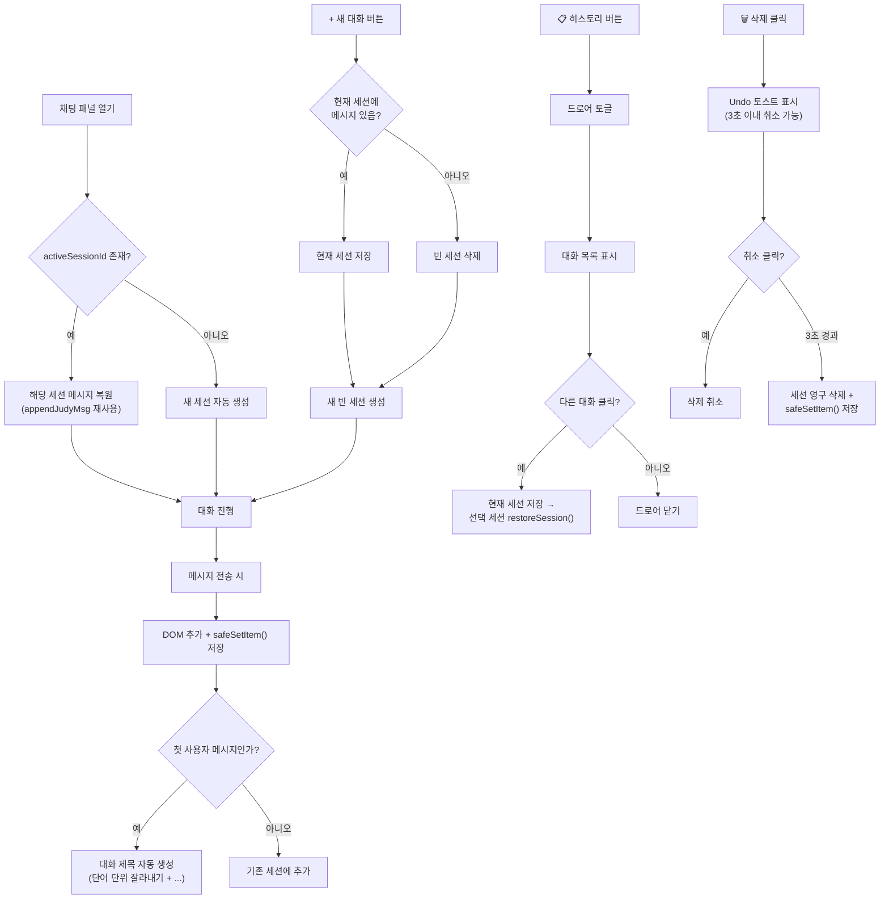

# 🐰 주디 채팅 히스토리 UX/UI 설계서 (최종)

---
- **태스크 ID**: BUNKER-2026-03-11-001
- **지시일**: 2026-03-11
- **담당팀**: 벙커 (BUNKER)
- **담당자**: 송PO
- **상태**: ✅ 기획 완료 (김감사 QA 승인) → 자비스팀 구현 대기
- **QA 통과**: 2026-03-11 — Overall Score 88.3점, CRITICAL 0건
---

## 1. 문제 정의

### 현재 상황 (AS-IS)
주디 채팅 패널의 대화 내용이 **패널 닫기 / 페이지 새로고침 시 전체 초기화**됩니다.

| 구분 | 현재 동작 | 심각도 |
|------|----------|--------|
| 패널 닫기(✕) 후 재오픈 | DOM은 남아있어 대화 유지 | 🟡 보통 |
| **페이지 새로고침/이동** | **대화 전체 초기화** | 🔴 심각 |
| 새 대화 시작 | 이전 대화와 섞임 | 🔴 심각 |
| 토큰 낭비 | 같은 질문 반복 요청 필요 | 🔴 심각 |

### 코드 원인 분석

```javascript
// 현재: 메시지를 DOM에만 추가, 저장 로직 없음
function appendJudyMsg(content, role) {
    var div = document.createElement('div');
    div.className = 'judy-msg ' + role;
    // ...
    judyChatMessages.appendChild(div);  // ← DOM only, no persistence
}

// toggleJudyChat: 단순 CSS 토글만 수행
// localStorage/서버 저장 로직: 없음
```

> [!CAUTION]
> 토큰을 소모하여 얻은 AI 응답이 사라지면, 같은 질문을 반복해야 하므로 **비용이 2배** 들고 사용자 경험이 극히 불량합니다.

---

## 2. 개선 방향 (TO-BE)

### 2.1 대표님 제안: Gemini/OpenAI/Claude 방식

세계 3대 AI 서비스가 검증한 **"대화 히스토리 + 새 대화"** 패턴:

| 기능 | Gemini | ChatGPT | Claude |
|------|--------|---------|--------|
| 대화 이력 목록 | 좌측 사이드바 | 좌측 사이드바 | 좌측 사이드바 |
| 새 대화 시작 | + 버튼 | 새 채팅 버튼 | New chat |
| 이전 대화 재진입 | ✅ 클릭 | ✅ 클릭 | ✅ 클릭 |
| 대화 삭제 | ✅ | ✅ | ✅ |
| 대화 제목 자동 생성 | ✅ 첫 질문 기반 | ✅ AI 생성 | ✅ 첫 질문 기반 |

### 2.2 🌟 채택 방식: 하이브리드 미니 드로어

주디는 독립 웹앱이 아닌 **워크스페이스 사이드패널**이므로, Gemini/OpenAI의 풀 사이드바 대신 **패널 내부 드로어**가 더 적합합니다.

| 비교 항목 | Gemini/OpenAI 풀 사이드바 | 🌟 미니 드로어 (채택) |
|----------|----------------------|-------------------|
| 공간 효율 | 좌측 사이드바가 채팅 영역 압박 | 패널 내부에서 해결 |
| 주디 특성 | 독립 앱용 UX | 사이드패널에 최적 |
| 구현 복잡도 | 레이아웃 대폭 변경 | 기존 패널 내부 수정만 |
| 모바일 대응 | 사이드바+채팅 = 화면 부족 | 드로어 토글로 깔끔 |

---

## 3. UI 목업

### 3.1 히스토리 드로어 열린 상태


**핵심 UI 요소:**
- **헤더**: `🐰 주디 (v3.0)` + 📋 히스토리 토글 + ➕ 새 대화 + ✕ 닫기
- **히스토리 드로어**: 최근 대화 목록 (제목 + 날짜/시간), 활성 대화 퍼플 하이라이트, 각 항목에 🗑️ 삭제 아이콘
- **드로어 높이 제한**: `max-height: 220px`, 초과 시 스크롤
- **대화 영역**: 현재 선택된 대화의 메시지 표시

### 3.2 일반 채팅 상태 (드로어 닫힘)


**핵심 UI 요소:**
- 헤더 바로 아래 **현재 대화 제목 바**: "오늘의 업무 브리핑 ∨" (탭하면 드로어 토글)
- 넓은 메시지 영역에 전체 대화 표시
- 채팅 입력 영역

---

## 4. 상세 설계

### 4.1 데이터 구조

> [!IMPORTANT]
> **[QA M-001 반영]** localStorage 키는 반드시 사용자명을 포함하여 사용자별 분리합니다.
> 공용 PC에서 다른 사용자의 대화가 노출되는 것을 방지합니다.

```javascript
// localStorage key: 'judy_chat_' + userName (사용자별 분리)
// 예: 'judy_chat_김민석', 'judy_chat_이지은'
{
  "sessions": [
    {
      "id": "1741697950_k8x2m9p4q",  // Date.now() + '_' + random(9)
      "title": "오늘의 업무 브리핑",
      "createdAt": "2026-03-11T20:50:00+09:00",
      "updatedAt": "2026-03-11T20:55:30+09:00",
      "messages": [
        { "role": "ai", "content": "안녕하세요! 주디입니다 🐰", "ts": 1741697950000 },
        { "role": "user", "content": "오늘 할 일 뭐야?", "ts": 1741697960000 },
        { "role": "ai", "content": "🔴 오늘 마감 (1건)...", "ts": 1741697975000 }
      ]
    }
  ],
  "activeSessionId": "1741697950_k8x2m9p4q",
  "maxSessions": 30
}
```

**세션 ID 생성 규칙:**
```javascript
function generateSessionId() {
    return Date.now() + '_' + Math.random().toString(36).substr(2, 9);
}
// 서버 동기화(2차) 시점에 서버측 UUID v4로 전환
```

### 4.2 저장 안전장치 (QuotaExceededError 방어)

> [!IMPORTANT]
> **[QA C-001 반영]** localStorage 5MB 제한 대비 필수 방어 로직입니다.
> 이 3가지가 구현되지 않으면 QA 승인이 취소됩니다.

```javascript
/**
 * 안전한 localStorage 저장 — QuotaExceededError 방어 + LRU 퇴거
 * 
 * @param {string} key - localStorage 키 (judy_chat_ + userName)
 * @param {object} data - 저장할 세션 데이터 객체
 * @returns {boolean} 저장 성공 여부
 */
function safeSetItem(key, data) {
    var json = JSON.stringify(data);
    
    try {
        localStorage.setItem(key, json);
        return true;
    } catch (e) {
        if (e.name === 'QuotaExceededError' || e.code === 22) {
            // LRU 퇴거: 가장 오래된 세션 삭제 후 재시도
            if (data.sessions.length > 1) {
                // 가장 오래된 세션 (updatedAt 기준) 제거
                data.sessions.sort(function(a, b) {
                    return new Date(a.updatedAt) - new Date(b.updatedAt);
                });
                var removed = data.sessions.shift();
                
                // activeSession이 삭제된 경우 다음 세션으로 전환
                if (data.activeSessionId === removed.id) {
                    data.activeSessionId = data.sessions[0] ? data.sessions[0].id : null;
                }
                
                // 사용자에게 토스트 알림
                showToast('💾 저장 공간 부족 — 오래된 대화 "' + removed.title + '"이 자동 정리되었습니다');
                
                // 재시도
                return safeSetItem(key, data);
            }
        }
        // 그래도 실패 시
        showToast('⚠️ 대화 저장에 실패했습니다. 브라우저 저장 공간을 확인해주세요.');
        console.error('[JudyChat] localStorage 저장 실패:', e);
        return false;
    }
}
```

**방어 정책 요약:**

| 단계 | 동작 | 사용자 알림 |
|------|------|-----------|
| 1차 | `setItem` 정상 성공 | 없음 (정상) |
| 2차 | `QuotaExceededError` → 가장 오래된 세션 삭제 후 재시도 | 토스트: "오래된 대화가 자동 정리되었습니다" |
| 3차 | 재시도도 실패 | 토스트: "대화 저장에 실패했습니다" + console.error |

### 4.3 메시지 복원 규칙

> [!IMPORTANT]
> **[QA M-002 반영]** XSS 방어를 위해 복원 시 반드시 기존 `appendJudyMsg()` 함수를 재사용합니다.
> 별도 복원 함수를 만들어 `innerHTML`을 직접 사용하는 것을 금지합니다.

```javascript
/**
 * 세션 메시지를 DOM에 복원
 * ⚠️ 반드시 appendJudyMsg()를 사용할 것 — direct innerHTML 금지
 * appendJudyMsg() 내부에서 sanitizeHtml(parseMd()) 파이프라인이 동작함
 */
function restoreSession(session) {
    // 기존 메시지 영역 초기화
    judyChatMessages.innerHTML = '';
    
    // 각 메시지를 기존 함수로 복원 (sanitization 보장)
    session.messages.forEach(function(msg) {
        appendJudyMsg(msg.content, msg.role);  // ← 기존 함수 재사용 필수
    });
    
    // 스크롤을 최하단으로
    judyChatMessages.scrollTop = judyChatMessages.scrollHeight;
}
```

### 4.4 사용자 플로우



### 4.5 핵심 기능 명세

| # | 기능 | 동작 설명 | QA 반영 | 우선순위 |
|---|------|----------|--------|---------|
| 1 | **대화 저장** | 매 메시지 전송 시 `safeSetItem()`으로 저장. `try-catch` + LRU 퇴거 포함 | C-001 ✅ | 🔴 HIGH |
| 2 | **사용자별 분리** | 키: `judy_chat_` + `userName`. 공용 PC 타인 노출 방지 | M-001 ✅ | 🔴 HIGH |
| 3 | **대화 복원** | 패널 열 때 `restoreSession()` → `appendJudyMsg()` 재사용 (XSS 방어) | M-002 ✅ | 🔴 HIGH |
| 4 | **새 대화** | + 버튼 클릭 시 현재 세션 저장 → 새 빈 세션 시작. 빈 세션은 저장 안 함 | m-002 ✅ | 🔴 HIGH |
| 5 | **히스토리 목록** | 📋 버튼으로 드로어 토글. `max-height: 220px` 스크롤. 모바일은 오버레이 | M-004 ✅ | 🔴 HIGH |
| 6 | **대화 전환** | 목록에서 대화 클릭 시 `restoreSession()`으로 전환 | — | 🔴 HIGH |
| 7 | **대화 삭제** | 🗑️ 클릭 → **Undo 토스트(3초)** → 취소 없으면 영구 삭제 | m-003 ✅ | 🟡 MEDIUM |
| 8 | **대화 제목** | 첫 사용자 메시지를 **단어 단위** 잘라내기 + "..." (최대 20자) | m-001 ✅ | 🟡 MEDIUM |
| 9 | **세션 수 제한** | 최대 30개, 초과 시 LRU 퇴거 | C-001 ✅ | 🟢 LOW |
| 10 | **출근 키워드** | 출근 브리핑 등 특수 대화는 **현재 세션에 포함** (별도 분리 안 함) | m-006 ✅ | 🟢 LOW |

### 4.6 CSS 변경 사항

```css
/* ═══ 히스토리 드로어 ═══ */

/* 헤더 버튼 그룹 */
.judy-chat-history-btn,
.judy-chat-new-btn {
    background: transparent;
    border: none;
    color: var(--text-color);
    font-size: 18px;
    cursor: pointer;
    width: 32px;
    height: 32px;
    display: flex;
    align-items: center;
    justify-content: center;
    border-radius: 6px;
}

.judy-chat-history-btn:hover,
.judy-chat-new-btn:hover {
    background: var(--surface-elevated);
}

/* 현재 대화 제목 바 */
.judy-chat-session-bar {
    padding: 6px 16px;
    font-size: 13px;
    color: var(--hint-color);
    text-align: center;
    border-bottom: 1px solid var(--border);
    cursor: pointer;
    user-select: none;
}

.judy-chat-session-bar:hover {
    background: var(--surface-elevated);
}

/* 히스토리 드로어 — [QA M-004] max-height 제한 */
.judy-chat-history-drawer {
    max-height: 0;
    overflow: hidden;
    transition: max-height 0.25s ease;
    border-bottom: 1px solid var(--border);
    background: var(--bg-color);
}

.judy-chat-history-drawer.open {
    max-height: 220px;
    overflow-y: auto;
}

/* 대화 항목 */
.judy-chat-history-item {
    display: flex;
    justify-content: space-between;
    align-items: center;
    padding: 10px 16px;
    cursor: pointer;
    font-size: 13px;
    color: var(--text-color);
    border-bottom: 1px solid rgba(255,255,255,0.05);
}

.judy-chat-history-item:hover {
    background: var(--surface-elevated);
}

.judy-chat-history-item.active {
    background: rgba(187, 134, 252, 0.15);
    color: var(--primary);
    font-weight: 600;
}

.judy-chat-history-item .title {
    flex: 1;
    overflow: hidden;
    text-overflow: ellipsis;
    white-space: nowrap;
}

.judy-chat-history-item .meta {
    font-size: 11px;
    color: var(--hint-color);
    margin-left: 8px;
    flex-shrink: 0;
}

/* 삭제 아이콘 — hover 시에만 표시 */
.judy-chat-history-delete {
    opacity: 0;
    border: none;
    background: transparent;
    color: var(--danger);
    cursor: pointer;
    font-size: 14px;
    margin-left: 4px;
    transition: opacity 0.15s;
}

.judy-chat-history-item:hover .judy-chat-history-delete {
    opacity: 0.7;
}

.judy-chat-history-delete:hover {
    opacity: 1 !important;
}

/* [QA M-004] 모바일: 오버레이 방식 드로어 */
@media (max-width: 768px) {
    .judy-chat-history-drawer.open {
        position: absolute;
        left: 0;
        right: 0;
        max-height: 60vh;
        background: var(--surface);
        box-shadow: 0 4px 12px rgba(0, 0, 0, 0.3);
        z-index: 10;
    }
}
```

### 4.7 대화 제목 생성 규칙

```javascript
/**
 * [QA m-001 반영] 단어 단위 잘라내기 + "..."
 * 첫 사용자 메시지를 기반으로 대화 제목 자동 생성
 */
function generateTitle(firstUserMessage) {
    var text = (firstUserMessage || '새 대화').trim();
    if (text.length <= 20) return text;
    
    // 단어(공백) 단위로 잘라서 20자 이내로
    var truncated = '';
    var words = text.split(' ');
    for (var i = 0; i < words.length; i++) {
        var next = truncated ? truncated + ' ' + words[i] : words[i];
        if (next.length > 18) break;  // "..." 추가 여유분 2자
        truncated = next;
    }
    return (truncated || text.substr(0, 18)) + '...';
}
```

---

## 5. 저장 전략 로드맵

| 단계 | 방식 | 장점 | 구현 시점 |
|------|------|------|----------|
| **1차** | `localStorage` (사용자별 키 분리) | 빠르고 간단, 서버 비용 0 | ✅ 즉시 |
| **2차** | 서버 동기화 (Spreadsheet/Supabase) + 대화 검색 + 날짜 그룹핑 | 기기 간 공유, 영구 보관 | 🔜 추후 |

> [!TIP]
> 1차 구현(`localStorage` + 사용자 분리 + QuotaExceededError 방어)만으로 핵심 문제(대화 초기화)가 해결됩니다.
> 2차에서 추가할 기능: 서버 동기화, 대화 검색(m-004), 날짜 그룹핑(m-005), 세션 ID UUID v4 전환

---

## 6. 위임 사항

### 🔀 업무 위임 안내

| 위임 대상 팀 | 전달 내용 | 우선순위 |
|-------------|----------|---------|
| 🤵 자비스 개발팀 (클로이 FE) | 주디 채팅 히스토리 UI + JS 구현 | 🔴 HIGH |
| 🤵 자비스 개발팀 (에이다 BE) | 필요 시 서버측 대화 저장 API (2차) | 🟢 LOW |

### 자비스팀 구현 체크리스트

**HTML 변경:**
- [ ] 채팅 패널 헤더에 📋 히스토리 / ➕ 새 대화 / ✕ 닫기 3버튼 구성
- [ ] 현재 대화 제목 바 (`judy-chat-session-bar`) 추가
- [ ] 히스토리 드로어 (`judy-chat-history-drawer`) 컨테이너 추가

**CSS 변경:**
- [ ] 섹션 4.6 CSS 전체 추가
- [ ] 모바일 미디어쿼리 오버레이 방식 포함

**JS 변경 (핵심):**
- [ ] `safeSetItem()` 구현 — `try-catch` + LRU 퇴거 + 토스트 (C-001)
- [ ] localStorage 키: `'judy_chat_' + userName` (M-001)
- [ ] `restoreSession()` 구현 — `appendJudyMsg()` 재사용 필수 (M-002)
- [ ] `generateSessionId()` — `Date.now() + '_' + random(9)`
- [ ] `generateTitle()` — 단어 단위 잘라내기 + "..." (m-001)
- [ ] 빈 세션(메시지 0건) 저장 안 함 (m-002)
- [ ] 삭제 시 Undo 토스트 3초 (m-003, 기존 토스트 시스템 재사용)
- [ ] 출근 키워드 대화는 현재 세션에 포함 (m-006)
- [ ] 패널 오픈 시 마지막 활성 세션 자동 복원
- [ ] 드로어 토글/대화 전환/새 대화 이벤트 핸들링

**⚠️ 금지사항:**
- ❌ 복원 시 `innerHTML` 직접 사용 금지 → 반드시 `appendJudyMsg()` 거칠 것
- ❌ `crypto.randomUUID()` 사용 금지 (1차) → `Date.now()` + `Math.random()` 사용
- ❌ `localStorage.setItem()` 직접 호출 금지 → 반드시 `safeSetItem()` 사용

---

## 7. QA 반영 이력

| QA ID | 심각도 | 내용 | 반영 위치 | 상태 |
|-------|-------|------|----------|------|
| C-001 | MAJOR (하향) | QuotaExceededError 방어 + LRU 퇴거 | 4.2 저장 안전장치 | ✅ 반영 |
| M-001 | MAJOR | 사용자별 키 분리 | 4.1 데이터 구조 | ✅ 반영 |
| M-002 | MAJOR | 복원 시 sanitization 파이프라인 | 4.3 메시지 복원 규칙 | ✅ 반영 |
| M-003 | — | 세션 ID 예측 가능 | 협의 후 삭제 | — 삭제 |
| M-004 | MAJOR | 드로어 높이 + 모바일 오버레이 | 4.6 CSS 변경 사항 | ✅ 반영 |
| m-001 | MINOR | 제목 단어 단위 잘라내기 | 4.7 대화 제목 생성 | ✅ 반영 |
| m-002 | MINOR | 빈 세션 미저장 | 4.4 플로우 + 4.5 명세 | ✅ 반영 |
| m-003 | MINOR | 삭제 확인 Undo 토스트 | 4.4 플로우 + 4.5 명세 | ✅ 반영 |
| m-004 | MINOR | 대화 검색 | 5. 로드맵 2차 | ✅ 2차 이관 |
| m-005 | MINOR | 날짜 그룹핑 | 5. 로드맵 2차 | ✅ 2차 이관 |
| m-006 | MINOR | 출근 키워드 세션 정책 | 4.5 명세 #10 | ✅ 반영 |

---

*작성: 송PO (벙커 팀) | 2026-03-11 | QA 승인: 김감사 QA팀 (88.3점, CRITICAL 0건)*
