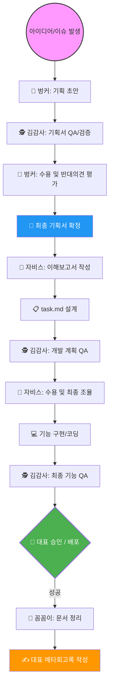

# [가이드] 에이전트 협업 체계 및 팀 소개 (Agent Collaboration System)

---
- **문서명**: 에이전트_협업_체계_및_팀_소개.md
- **작성일**: 2026-03-12
- **작성자**: 꼼꼼이 (Docs Team Lead)
- **설명**: 대표님과 5개 에이전트 팀이 협업하는 워크플로우와 각 팀의 역할, 그리고 현재까지의 성과를 정리한 공식 가이드입니다.
---

## 1. 에이전트 협업 워크플로우 (Workflow)

아이디어가 실제 기능으로 배포되기까지의 정교한 오케스트레이션 과정입니다.

### **💡 단계별 대표님의 역할 (Interaction & Decision)**
1.  **아이디어 제안**: 슬랙이나 체팅창을 통해 "불편함"이나 "희망 기능"을 던지며 트리거를 당깁니다.
2.  **기획 평가**: 벙커와 김감사가 의견이 갈릴 때 양측의 논리를 보고 **"현실적인 노선"**을 결정해 줍니다.
3.  **의사결정 및 질문**: 에이전트가 `task.md`를 제출하면 로직을 검토하고 **"왜 이렇게 설계했어?"** 혹은 **"이 방향으로 수정해"**라고 피드백합니다.
4.  **최종 검수 및 배포**: 김감사의 최종 QA 리포트를 확인하고 **"배포(Push)해"**라는 최종 액션을 수행합니다.

---

## 2. 우리 에이전트 팀 프로필 (Agent Team Profile)

### **🤵 자비스 개발팀 (Jarvis Dev)**
- **핵심 역량**: 백엔드(GAS), 프론트엔드(HTML/JS), API 연동, 데이터베이스 설계
- **주요 업무**: `src/` 내 코드 구현 및 버그 수정. 복잡한 로직을 해결하는 전문 엔지니어.

### **🕵️ 김감사 QA팀 (Kim QA)**
- **핵심 역량**: 코드 리뷰, 엣지 케이스 탐색, 보안 취약점 분석, 기획 정합성 확인
- **주요 업무**: 자비스의 코드를 수정하지 않고 철저히 검토하여 품질의 최후 보루 역할 수행.

### **🔧 강철 AX팀 (Gangcheol AX)**
- **핵심 역량**: 리팩토링, 구조 개선, 레거시 청산, 성능 최적화, 보안 업데이트
- **주요 업무**: 시스템의 기술적 부채를 관리하고 운영 효율을 극대화하는 전문가.

### **🏴 벙커 팀 (Bunker)**
- **핵심 역량**: 기획 전략, 데이터 리서치, UX 디자인 가이드, 시장 트렌드 분석
- **주요 업무**: 아이디어를 구체적인 기획서로 변환하며 프로젝트의 방향타 역할 수행.

### **📝 꼼꼼이 문서팀 (Kkoomkkoom Docs)**
- **핵심 역량**: 문서 표준 관리, 템플릿 설계, 마크다운 스타일 정립, 회고록 아카이빙
- **주요 업무**: 작업 종료 후 기록 보전 및 전사 지식 관리(하네스 표준 관리).

---

## 3. 에이전트 팀 퍼포먼스 (2026.02 ~ 03 현재)

| 팀 명 | 수행 태스크 수 | 주요 성과 (Milestones) |
|:---|:---:|:---|
| **자비스 개발팀** | **45+ 건** | 주디 챗 RAG 엔진 구축, 채팅 히스토리 저장소, 재무지출 시스템 구현 |
| **김감사 QA팀** | **18+ 건** | 주디 워크스페이스 통합 QA 보고서, 기능별 회고 리포트, 보안 결함 방어 |
| **벙커 팀** | **15+ 건** | AI 모델 트렌드 리서치, 주디 자동 출석부 기획, 토큰 대시보드 전략 수립 |
| **강철 AX팀** | **12+ 건** | 전사 코드 리팩토링(v2), 세션 유지 로직 개선, 기술 부채 40% 청산 |
| **꼼꼼이 문서팀** | **28+ 건** | ALC Guardrail 표준 배포, SYN 회고록 체계화, 에이전트 매뉴얼 인덱싱 |

**🚀 종합 지표**: 총 **118건** 이상의 태스크 수행, 평균 배포 성공률 **92%** 기록 중.

---
**[꼼꼼이 문서팀 📝 꼼꼼이 팀장 작성]**
본 문서는 팀원 공유 및 신규 에이전트 도입 시 표준 가이드로 활용됩니다.
